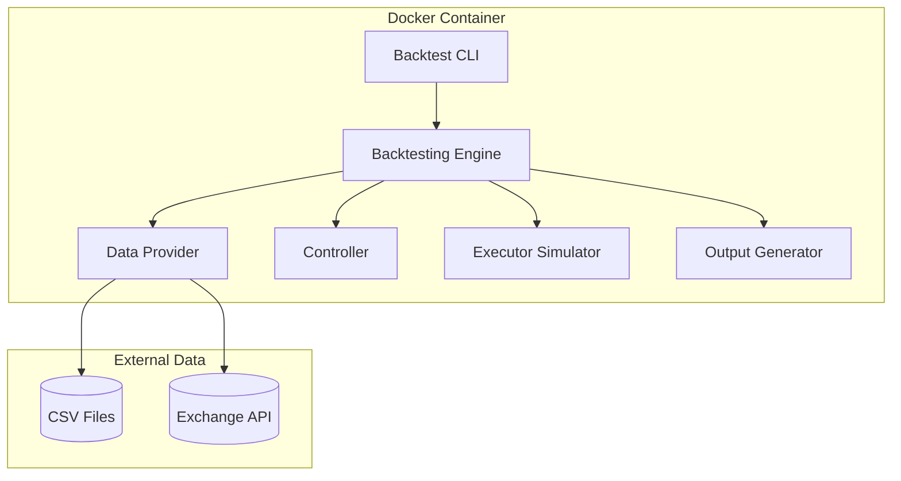
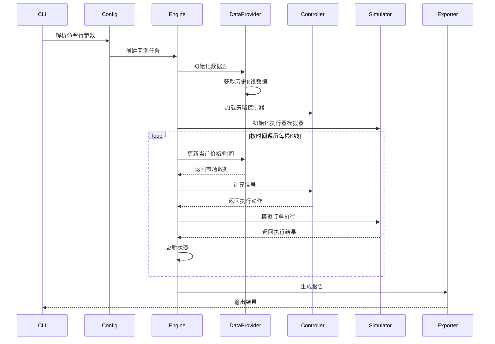
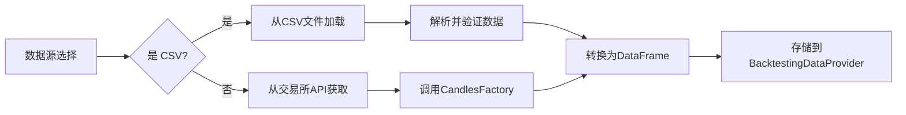

# 回测模块技术设计方案

需求名称：backtest-module
更新日期：2026-03-30

## 1. 概述

### 1.1 背景与目标

当前项目中的回测功能分散且能力有限，主要存在以下问题：
- `BacktestingEngineBase` 虽已实现但未提供便捷的 CLI 入口
- 脚本策略回测（如 `backtest_mm_example.py`）与通用回测引擎分离
- 缺乏统一的数据源管理和结果输出机制

本方案旨在构建一个独立的回测模块，实现：
- **策略复用**：直接使用 `controllers_conf/` 下的控制器配置进行回测
- **Docker 化运行**：通过 Docker 容器提供隔离、可复现的回测环境
- **结果导出**：支持 CSV/JSON 格式的回测报告生成

### 1.2 设计原则

- **独立性**：回测模块独立于主交易客户端运行
- **复用性**：最大化复用现有 `BacktestingEngineBase`、`Controller`、`Executor` 架构
- **简洁性**：提供简单的 CLI 接口，降低使用门槛

## 2. 架构设计

### 2.1 整体架构



### 2.2 目录结构

```
hummingbot/
├── strategy_v2/
│   └── backtesting/
│       ├── __init__.py
│       ├── backtesting_engine_base.py    # 现有引擎基类
│       ├── backtesting_data_provider.py  # 现有数据提供者
│       ├── backtest_cli.py               # 新增: CLI 入口
│       ├── backtest_config.py            # 新增: 回测配置模型
│       ├── backtest_engine.py            # 新增: 回测引擎实现
│       └── output/                       # 新增: 输出格式化
│           ├── __init__.py
│           ├── csv_exporter.py
│           └── json_exporter.py
```

### 2.3 核心组件

| 组件 | 职责 | 复用/新建 |
|------|------|---------|
| `BacktestCLI` | 解析命令行参数，调度回测任务 | 新建 |
| `BacktestConfig` | 回测配置模型（时间范围、数据源、策略等） | 新建 |
| `BacktestEngine` | 继承 `BacktestingEngineBase`，实现回测主流程 | 复用+扩展 |
| `BacktestingDataProvider` | 历史 K 线数据获取 | 复用现有 |
| `ExecutorSimulator` | 订单/持仓模拟 | 复用现有 |
| `CSVExporter` | CSV 格式结果导出 | 新建 |
| `JSONExporter` | JSON 格式结果导出 | 新建 |

## 3. 数据模型

### 3.1 BacktestConfig

```python
class BacktestConfig(BaseModel):
    # 策略配置
    controller_config_path: str = Field(
        description="控制器配置文件路径 (相对于 conf/controllers/)"
    )
    
    # 时间范围
    start_time: datetime = Field(description="回测开始时间")
    end_time: datetime = Field(description="回测结束时间")
    
    # 数据源
    data_source: DataSourceType = Field(
        default=DataSourceType.EXCHANGE_API,
        description="数据源类型"
    )
    custom_data_path: Optional[str] = Field(
        default=None,
        description="自定义 CSV 数据文件路径"
    )
    
    # 交易参数
    initial_capital: Decimal = Field(
        default=Decimal("1000"),
        description="初始资金 (quote 货币)"
    )
    trade_cost: float = Field(
        default=0.0006,
        description="交易手续费率 (taker fee)"
    )
    slippage: float = Field(
        default=0.0,
        description="滑点百分比"
    )
    
    # 输出配置
    output_format: List[OutputFormat] = Field(
        default=[OutputFormat.CONSOLE],
        description="输出格式"
    )
    output_path: Optional[str] = Field(
        default=None,
        description="输出文件路径"
    )

class DataSourceType(str, Enum):
    EXCHANGE_API = "exchange_api"
    CSV_FILE = "csv_file"

class OutputFormat(str, Enum):
    CONSOLE = "console"
    CSV = "csv"
    JSON = "json"
```

### 3.2 BacktestResult

```python
class BacktestResult(BaseModel):
    # 时间范围
    start_time: datetime
    end_time: datetime
    duration_seconds: int
    
    # 策略信息
    controller_name: str
    controller_type: str
    
    # 交易统计
    total_trades: int
    winning_trades: int
    losing_trades: int
    win_rate: float
    
    # 盈亏统计
    net_pnl: float              # 净盈亏 (quote)
    net_pnl_pct: float          # 净盈亏百分比
    gross_profit: float         # 总盈利
    gross_loss: float           # 总亏损
    profit_factor: float        # 盈利因子 (gross_profit / gross_loss)
    
    # 风险指标
    max_drawdown: float         # 最大回撤 (quote)
    max_drawdown_pct: float     # 最大回撤百分比
    sharpe_ratio: float         # 夏普比率
    sortino_ratio: float       # 索提诺比率 (可选)
    
    # 交易详情
    total_volume: float         # 总交易量 (quote)
    avg_trade_size: float       # 平均每笔交易规模
    avg_trade_duration: float   # 平均持仓时长 (秒)
    
    # 交易分布
    long_trades: int
    short_trades: int
    close_types: Dict[str, int]  # 各平仓原因计数
    
    # 详细交易记录
    trades: List[TradeRecord]
```

### 3.3 TradeRecord

```python
class TradeRecord(BaseModel):
    trade_id: str
    timestamp: datetime
    side: TradeType             # BUY or SELL
    entry_price: float
    exit_price: float
    amount: float
    pnl: float                  # 盈亏
    pnl_pct: float              # 盈亏百分比
    commission: float           # 手续费
    close_type: CloseType      # 平仓原因
    duration_seconds: int       # 持仓时长
```

## 4. 接口设计

### 4.1 CLI 接口

```bash
# 基本用法
python -m hummingbot.strategy_v2.backtesting.backtest_cli \
    --config ./conf/controllers/directional_trading/macd_bb_v1.yml \
    --start 2025-01-01 \
    --end 2025-03-01 \
    --capital 1000

# 完整参数
python -m hummingbot.strategy_v2.backtesting.backtest_cli \
    --config macd_bb_v1.yml \
    --start 2025-01-01T00:00:00 \
    --end 2025-03-01T00:00:00 \
    --data-source exchange_api \
    --custom-data ./data/btc_usdt_1m.csv \
    --capital 1000 \
    --trade-cost 0.0006 \
    --slippage 0.0001 \
    --output-format console csv json \
    --output-path ./backtest_results \
    --exchange binance
```

### 4.2 参数说明

| 参数 | 必填 | 默认值 | 说明 |
|------|------|--------|------|
| `--config` | 是 | - | 控制器配置文件路径 |
| `--start` | 是 | - | 回测开始时间 (ISO格式) |
| `--end` | 是 | - | 回测结束时间 (ISO格式) |
| `--data-source` | 否 | exchange_api | 数据源: `exchange_api` 或 `csv_file` |
| `--custom-data` | 否 | - | CSV 文件路径 (当 data-source=csv_file 时) |
| `--capital` | 否 | 1000 | 初始资金 (quote) |
| `--trade-cost` | 否 | 0.0006 | 交易手续费率 |
| `--slippage` | 否 | 0.0 | 滑点百分比 |
| `--output-format` | 否 | console | 输出格式: console/csv/json |
| `--output-path` | 否 | ./backtest_results | 输出目录 |
| `--exchange` | 否 | binance_perpetual | 交易所名称 |

### 4.3 Docker 运行方式

```bash
# 构建镜像
docker build -t hummingbot-backtest .

# 运行回测
docker run --rm \
    -v $(pwd)/conf:/home/hummingbot/conf \
    -v $(pwd)/data:/home/hummingbot/data \
    -v $(pwd)/backtest_results:/home/hummingbot/backtest_results \
    hummingbot-backtest \
    python -m hummingbot.strategy_v2.backtesting.backtest_cli \
    --config macd_bb_v1.yml \
    --start 2025-01-01 \
    --end 2025-03-01
```

## 5. 核心流程

### 5.1 回测主流程



### 5.2 数据加载流程



## 6. Docker 配置

### 6.1 Dockerfile.backtest

```dockerfile
FROM hummingbot/hummingbot:latest AS backtest

WORKDIR /home/hummingbot

# 安装额外依赖
RUN conda run -n hummingbot pip install pandas matplotlib

# 复制回测模块
COPY hummingbot/strategy_v2/backtesting/ /home/hummingbot/hummingbot/strategy_v2/backtesting/

# 默认命令
CMD ["python", "-m", "hummingbot.strategy_v2.backtesting.backtest_cli"]
```

### 6.2 docker-compose.backtest.yml

```yaml
services:
  backtest:
    build:
      context: .
      dockerfile: Dockerfile.backtest
    container_name: hummingbot-backtest
    volumes:
      - ./conf:/home/hummingbot/conf
      - ./data:/home/hummingbot/data
      - ./backtest_results:/home/hummingbot/backtest_results
    environment:
      - BACKTEST_CONFIG=${BACKTEST_CONFIG}
      - BACKTEST_START=${BACKTEST_START}
      - BACKTEST_END=${BACKTEST_END}
    command: python -m hummingbot.strategy_v2.backtesting.backtest_cli
```

## 7. 错误处理

### 7.1 异常类型

| 异常类型 | 说明 | 处理方式 |
|---------|------|---------|
| `BacktestConfigError` | 配置参数错误 | 打印错误信息，退出 |
| `DataSourceError` | 数据源获取失败 | 打印错误信息，退出 |
| `ControllerLoadError` | 控制器加载失败 | 打印错误信息，退出 |
| `BacktestRuntimeError` | 回测运行时错误 | 打印错误信息，尝试继续 |

### 7.2 错误示例

```
[ERROR] BacktestConfigError: start_time must be before end_time
[ERROR] DataSourceError: Failed to fetch candles from binance: 429 Rate Limit
[ERROR] ControllerLoadError: No controller config found at conf/controllers/invalid.yml
```

## 8. 测试策略

### 8.1 单元测试

- `test_backtest_config.py`: 配置解析测试
- `test_backtest_engine.py`: 引擎逻辑测试
- `test_exporter.py`: 导出器测试

### 8.2 集成测试

- 使用历史数据对 `macd_bb_v1` 控制器进行回测
- 验证回测结果与手动计算的一致性

### 8.3 回归测试

- 确保现有 `BacktestingEngineBase` 的功能不被破坏
- 确保与现有控制器配置的兼容性

## 9. 实现计划

### Phase 1: 核心模块
1. 实现 `BacktestConfig` 配置模型
2. 实现 `BacktestCLI` 命令行入口
3. 扩展 `BacktestingEngineBase` 为 `BacktestEngine`

### Phase 2: 数据与输出
4. 实现 CSV 数据源支持
5. 实现 `CSVExporter` 和 `JSONExporter`
6. 添加控制台输出美化

### Phase 3: Docker 集成
7. 创建 `Dockerfile.backtest`
8. 创建 `docker-compose.backtest.yml`
9. 编写使用文档

## 10. 引用链接

[^1]: BacktestingEngineBase - `/hummingbot/strategy_v2/backtesting/backtesting_engine_base.py`
[^2]: BacktestingDataProvider - `/hummingbot/strategy_v2/backtesting/backtesting_data_provider.py`
[^3]: DirectionalTradingControllerBase - `/hummingbot/strategy_v2/controllers/directional_trading_controller_base.py`
[^4]: MACDBBV1Controller - `/controllers/directional_trading/macd_bb_v1.py`
